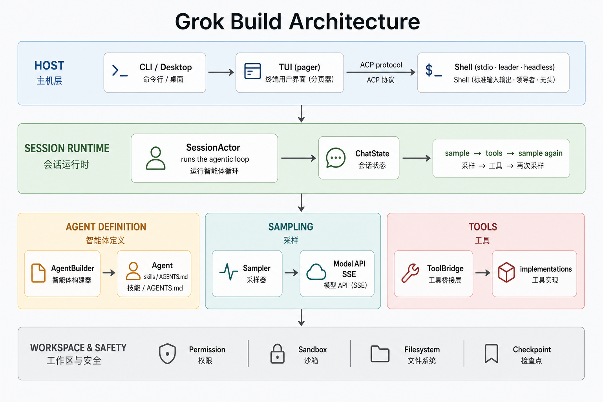
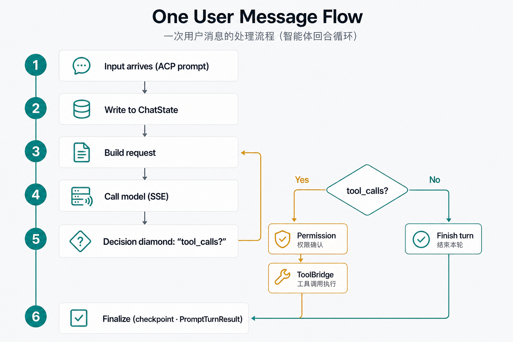

# Grok Build 架构与 Agent 实现

> SpaceXAI 终端 AI coding agent（Rust）。本文描述仓库分层、Agent 装配与 Session 运行时细节。  
> 源码同步自 SpaceXAI monorepo；根 `Cargo.toml` 为生成物，请优先改各 crate 的 `Cargo.toml`。

---

## 1. 一句话总览

| 层 | 职责 |
|---|---|
| **`xai-grok-agent`** | 造出绑定工具与提示词的 `Agent` |
| **`xai-grok-shell::SessionActor`** | 跑 agentic turn（采样 → 工具 → 再采样） |
| **采样 / 对话 / 工具 / Workspace** | 各自独立 crate，经 handle/actor 拼进同一条 loop |

---

## 2. 仓库布局

| 路径 | 内容 |
|------|------|
| `crates/codegen/xai-grok-pager-bin` | 组合根；产出 `xai-grok-pager` 二进制（安装名 `grok`） |
| `crates/codegen/xai-grok-pager` | TUI：滚动区、输入、模态、渲染 |
| `crates/codegen/xai-grok-shell` | Agent 运行时 + stdio / leader / headless 入口 |
| `crates/codegen/xai-grok-agent` | Agent 定义、Builder、系统提示装配、插件 |
| `crates/codegen/xai-grok-tools` | 工具实现（终端、文件编辑、搜索等） |
| `crates/codegen/xai-grok-workspace` | 主机 FS、VCS、执行、checkpoint |
| `crates/codegen/...` | 配置、MCP、markdown、sandbox、sampler 等 |
| `crates/common/`、`crates/build/`、`prod/mc/` | 共享叶子 crate |
| `third_party/` | 第三方源码（如 Mermaid 栈） |

---

## 3. 分层架构



**怎么读这张图（从上到下）：**

| 层 | 一句话 |
|---|---|
| **1 Host** | 用户从 CLI / TUI 进来；TUI 只负责界面，经 ACP 连到 shell |
| **2 Session** | `SessionActor` 真正跑循环：采样 → 工具 → 再采样 |
| **3a Agent 定义** | `AgentBuilder` 造出带提示词和工具的 `Agent`，**不负责**跑 loop |
| **3b 采样** | `SamplerHandle` 用 HTTP SSE 调模型 |
| **3c 工具** | `ToolBridge` 把模型的 tool call 落到具体实现 |
| **4 Workspace** | 权限、沙箱、文件系统、checkpoint |

旁路挂在 Session 上：Subagent · memory · compaction · lifecycle。

### 关键 crate 职责

| Crate | 角色 | 关键类型 / 入口 |
|-------|------|----------------|
| `xai-grok-agent` | Agent 定义、提示词装配、插件/skills | `Agent`, `AgentBuilder`, `PromptContext` |
| `xai-grok-shell` | Session 宿主与 agentic loop | `SessionActor`, `MvpAgent`, `run_*` |
| `xai-grok-pager*` | TUI 渲染与二进制入口 | pager-bin → pager → ACP client |
| `xai-chat-state` | 对话状态 actor | `ChatStateHandle::build_request` |
| `xai-grok-sampler` | 模型 HTTP/SSE 与并发采样 | `SamplerHandle::submit_and_collect` |
| `xai-grok-tools` | 工具实现与 ToolBridge | `FinalizedToolset::call` |
| `xai-tool-runtime` | Tool trait / 流式契约 | `Tool::execute` / `run` |
| `xai-tool-protocol` | 线协议、hooks、session events | JSON-RPC、`ToolId` |
| `xai-grok-workspace` | FS、VCS、权限、checkpoint | `PermissionManager`, `RewindCheckpoint` |
| `xai-grok-compaction` | 上下文压缩引擎 | `code_compaction`（full-replace） |
| `xai-grok-memory` | 长期记忆与检索 | `~/.grok/memory` + SQLite |
| `xai-grok-subagent-resolution` | 子 agent 覆盖解析（纯逻辑） | `resolve_effective_overrides` |
| `xai-acp-lib` / ACP | 编辑器 / TUI 协议 | `AgentSideConnection` |

---

## 4. 运行入口

源码：`crates/codegen/xai-grok-shell/src/agent/app.rs`

| 入口 | 函数 | 场景 |
|------|------|------|
| Stdio ACP | `run_stdio_agent` | 编辑器 / 管道嵌入 |
| Leader | `run_leader` | IPC socket；多客户端 + 可选 relay |
| Headless | `run_headless` / `run_headless_no_browser` | CI / 脚本；强制 grok.com session |
| 本地 agent | `spawn_agent_local` | `MvpAgent` + `AgentSideConnection` |
| TUI | `xai-grok-pager` | 全屏交互；经 ACP 连 leader/stdio，**不内嵌** agent loop |

---

## 5. Agent 实现（`xai-grok-agent`）

### 5.1 `Agent` 结构

源码：`crates/codegen/xai-grok-agent/src/agent.rs`

```rust
pub struct Agent {
    definition: AgentDefinition,
    prompt_context: PromptContext,
    system_prompt: String,           // 已渲染缓存
    tool_bridge: Arc<ToolBridge>,
    reminder_policy: ReminderPolicy,
    compaction_policy: CompactionPolicy,
    hosted_tools: Vec<HostedTool>,   // 服务端 WebSearch 等
    backend_search_enabled: bool,
}
```

要点：

- **不是** turn 循环本身，而是已装配好的会话绑定对象。
- **不可跨 session 移植**：绑定具体 `ToolBridge` 与已渲染 prompt。
- 构造后逻辑上不可变；MCP 注册等通过 `ToolBridge` 内部锁变更。

常用访问器：`system_prompt()`、`tool_bridge()`、`tool_definitions()`、`agents_md_user_reminder()`、`should_auto_compact(...)`、`compact_system_prompt()`。

### 5.2 `AgentBuilder::build`

源码：`crates/codegen/xai-grok-agent/src/builder.rs`

主流程：

1. `resolve_definition()`
2. `list_skills_with_plugins()` / 预加载 skills → 注入 `prompt_body`
3. `ToolBridge::get_builder()` + 按开关注入 memory / web / lsp / image 等工具
4. allowlist / `disallowed_tools` / subagent type 过滤
5. `finalize_builder` → 构建 `PromptContext` → `render()` → `Agent::new(...)`

### 5.3 Agent 定义文件

Markdown + YAML frontmatter，路径：

1. **项目级（最高）**：`.grok/agents/*.md`（从 cwd 上溯到 git root）
2. **用户级**：`~/.grok/agents/*.md`
3. **兼容路径**（可选）
4. **内置**：如 `grok-build`、`browser-use`

| Frontmatter 字段 | 说明 |
|------------------|------|
| `name` / `description` | 必填 |
| `promptMode` | `extend`（默认）或 `full` |
| `tools` / `disallowedTools` | 工具白/黑名单 |
| `permissionMode` | `default` / `acceptEdits` / `dontAsk` / `plan` |
| `skills` | 预加载 skill 名 |
| `agentsMd` | 是否注入 AGENTS.md（默认 true） |
| `completionRequirement` | 结束 turn 前必须调用的工具（编排模式） |
| `toolConfig` | 每工具 retry 等执行配置 |

### 5.4 Prompt 装配管线

```
promptMode: extend                     promptMode: full
──────────────────                     ─────────────────
1. Base template (MiniJinja)           1. Markdown body (MiniJinja, ${{ }}/$)
   (tool conventions, formatting,      2. AGENTS.md section (if agentsMd: true)
    user_info, background tasks)       3. Skills section
2. Markdown body (appended raw)
3. AGENTS.md section (if agentsMd: true)
4. Skills section
```

模板变量示例：`${{ tools.read_file }}`、`${{ os_name }}`、`${{ working_directory }}`、`${{ current_date }}`。条件块：`$...$`。

旁路注入（进**用户消息**，非 system）：

- `agents_md_user_reminder()` — AGENTS.md
- `personas_user_reminder()` — personas（subagent 侧压制）

Skills 发现优先级：Local → Repo → User → Plugin → Bundled。

相关模块：

| 模块 | 路径 | 职责 |
|------|------|------|
| `prompt/context` | `PromptContext` / `PromptAudience` | 占位符与 render |
| `prompt/agents_md` | AGENTS.md 发现与格式化 | |
| `prompt/skills` | skills 列表与注入 | |
| `prompt/template` | base / subagent / compact 模板 | |
| `prompt/subagent_prompts` | GENERAL_PURPOSE / EXPLORE / PLAN | |
| `plugins/` | plugin.json、trust、registry、marketplace | |
| `compaction` | `CompactionPolicy`（阈值、模型、two-pass） | |
| `discovery` | `.grok/agents` / 内置 subagent | |

---

## 6. Session 运行时（`xai-grok-shell`）

### 6.1 主循环与关键类型

| 类型 / 函数 | 位置 | 作用 |
|-------------|------|------|
| `run_session` | `session/acp_session_impl/run_loop.rs` | 命令 / 事件 / idle memory flush |
| `handle_prompt` | `session/acp_session_impl/turn.rs` | 单条用户消息 turn |
| `run_turn_via_sampler` | `sampler_turn.rs` | 一轮模型调用 |
| `execute_tool_calls` | `tool_calls.rs` | 一批工具执行 |
| `SessionActor` | `session/acp_session.rs` | 持有 agent、chat_state、sampler |
| `SamplerTurnOutcome` | sampler_turn | `Response` / `CompactAndResubmit` / `RefreshAuthAndResubmit` |
| `ToolLoop` | tool_calls | PermissionReject / Cancelled / Followup / 继续 |

### 6.2 Turn 时序（一条用户消息）



| 步骤 | 做什么 |
|------|--------|
| 1 | ACP `session/prompt` → `SessionActor::handle_prompt` |
| 2 | `push_user_message`（可带 AGENTS.md / personas reminder） |
| 3 | `build_request` 组装发给模型的上下文 |
| 4 | `run_turn_via_sampler`（SSE）拿到 `ConversationResponse` |
| 5a | **有** tool_calls → 权限 → `ToolBridge.call` → `push_tool_result` → 回 3 |
| 5b | **无** tool_calls → 结束 loop |
| 6 | checkpoint / memory flush → `PromptTurnResult` |

### 6.3 Agentic loop 伪代码

```text
push_user_message  (+ AGENTS.md / personas / system-reminder)
loop:
  effective_tools = agent.tool_definitions()  (+ MCP, structured output…)
  request = chat_state_handle.build_request(...)
  match run_turn_via_sampler(request):
    Response(r)           → 继续处理
    CompactAndResubmit    → continue
    RefreshAuthAndResubmit → backoff → continue
  if tool_calls:
    execute_tool_calls  → prepare_tool_call → ToolBridge::call → push_tool_result
    continue
  else:
    TodoGate / interjection drain → TurnOutcome::Completed
finalize_turn_bookkeeping → PromptTurnResult
```

对应代码片段（`turn.rs`）：

```rust
let request = self.chat_state_handle.build_request(...).await?;
let (response, latency) = match self.run_turn_via_sampler(request.clone()).await? {
    SamplerTurnOutcome::Response(r, latency) => (r, latency),
    SamplerTurnOutcome::CompactAndResubmit => continue,
    SamplerTurnOutcome::RefreshAuthAndResubmit => { /* backoff */ continue; }
};
// … if tool_calls: execute_tool_calls; else complete
```

---

## 7. 工具系统

### 7.1 三层分工

| Crate | 角色 |
|-------|------|
| `xai-tool-protocol` | 线协议：JSON-RPC、`ToolId`、hooks、session events |
| `xai-tool-runtime` | 运行时契约：`Tool` / `ToolDispatch` / `ToolCallContext` / streaming |
| `xai-grok-tools` | 具体工具 + `ToolRegistryBuilder` / `FinalizedToolset` / `ToolBridge` |

### 7.2 `Tool` trait

源码：`crates/common/xai-tool-runtime/src/tool.rs`

- 实现 `run`（阻塞）或 `execute`（流式）；运行时只调 `execute`。
- 流形状：`[Progress(_)* , Terminal(Result<T, ToolError>)]` — 恰好一个 Terminal。

### 7.3 注册与调用

1. 启动时 `register_tool_pack` → `ToolRegistryBuilder`
2. `AgentBuilder::build` 产出工具配置
3. `ToolBridge::finalize_builder(...)` → `FinalizedToolset`
4. 运行时：`ToolBridge::call(name, args, tool_call_id)` → `ToolRunResult`
5. MCP：`ToolBridge::register_mcp_tools` 动态挂载

### 7.4 权限与沙箱

- **权限**：`xai-grok-workspace` 的 `PermissionManager` — yolo、policy allow/deny/ask、auto classifier、sandbox_auto、session/persisted grant、safe_command 等。
- **沙箱**：`xai-grok-sandbox`（基于 nono：Landlock / Seatbelt）；配置可来自 `.grok/sandbox.toml`。

---

## 8. 采样与模型

| 组件 | 说明 |
|------|------|
| `SamplingClient` | 原始 HTTP/SSE（Chat Completions / Responses / Messages） |
| `SamplerHandle` + `SamplerActor` | 并发请求、retry、cancel；`submit_and_collect` |
| `xai-grok-sampling-types` | `ConversationRequest` / `Response` / `ToolSpec` / `HostedTool`（无 I/O） |
| `xai-grok-models` | 嵌入默认模型 ID；解析顺序：CLI > ENV > config.toml > remote > defaults |

流式事件经 `eventsource_stream` 解析；session 侧有 stream-drain barrier，保证 UI 事件顺序。

---

## 9. Chat State / Memory / Compaction

### Chat state（`xai-chat-state`）

Actor 持有：`conversation`、`sampling_config`、`prompt_index`、`total_tokens`。

`ChatStateHandle`：`push_user_message` / `push_assistant_response` / `push_tool_result` / `build_request`。

`build_conversation_request` 会：

1. 内联图片字节预算驱逐  
2. 工具结果剪枝（上下文占用过高时）  
3. memory reminder 注入  
4. 组装 `ConversationRequest`

### Memory（`xai-grok-memory`）

- 路径：`~/.grok/memory/` + workspace hash  
- `MEMORY.md`、session logs、SQLite + embedding 搜索  
- shell idle flush / dream（`run_loop` timers）  
- 工具：`memory_search` / `memory_get`

### Compaction

| 层 | 位置 |
|----|------|
| 策略 | `Agent.compaction_policy`（默认约 85% 阈值、compact model、two-pass 等） |
| 引擎 | `xai-grok-compaction::code_compaction`（full-replace） |
| 宿主 | `shell/session/compaction.rs` |
| 触发 | usage 阈值，或 context-length 错误 → `CompactAndResubmit` |
| 压缩后 prompt | `Agent::compact_system_prompt()` → `COMPACT_SYSTEM_PROMPT` |

---

## 10. Subagent

| 环节 | Crate / 位置 | 说明 |
|------|--------------|------|
| 解析 | `xai-grok-subagent-resolution` | `resolve_effective_overrides`：显式 > role > persona > parent；无 I/O |
| 发现 | `xai-grok-agent::discovery` | 内置 `general-purpose` / `explore` / `plan` + `.grok/agents` |
| 执行 | `shell/agent/subagent/` | `handle_subagent_request` + `SubagentCoordinator` |
| 构建 | 同 `AgentBuilder` | `PromptAudience::Subagent`、紧凑模板、无 personas catalog |

Coordinator 管理 pending / active / completed，以及 turn-blocking vs background、usage 归属。

---

## 11. Workspace

`xai-grok-workspace` 子系统：

| 子系统 | 要点 |
|--------|------|
| FS | local / client / ACP / walk / fuzzy / content |
| VCS | git / jj status；checkpoint 域 |
| Permissions | policy、prompter、auto、bash splitting |
| Checkpoints | `RewindCheckpoint { prompt_index, fs, hunks }`；`TurnBoundary` |
| Worktree | fork / isolation |
| Hub | workspace server / RPC |

`WorkspaceHandle::on_turn_boundary` 是 turn/prompt 边界的内部入口；rewind 按 `prompt_index` 恢复 FS + hunks（可选 git）。

---

## 12. 端到端数据流

1. **入口**：ACP `session/prompt` → `SessionActor::handle_prompt`
2. **预处理**：图片归一化、slash/skill、`TurnActiveGuard`、lifecycle TurnStart
3. **写入对话**：`push_user_message`；可选 AGENTS.md / personas / system-reminder
4. **Agentic loop**：
   - 收集 tool defs（含 MCP、hosted_tools）
   - `build_request` → `ConversationRequest`
   - `run_turn_via_sampler` → SSE → `ConversationResponse`
   - 无 tool_calls → TodoGate → 完成
   - 有 tool_calls → 权限 → `ToolBridge::call` → `push_tool_result` → 下一轮
5. **副作用**：ACP 流式 chunk、workspace checkpoint、memory flush、subagent spawn（`task` 工具）
6. **结束**：`finalize_turn_bookkeeping` → `PromptTurnResult`

---

## 13. 设计取舍

1. **定义与执行分离**：`Agent` 是配置+能力快照；循环在 `SessionActor`。
2. **Actor + Handle**：chat state / sampler / session 用消息通道，避免大锁。
3. **ACP 为宿主边界**：TUI、编辑器、headless 共用同一 agent 后端。
4. **提示词分层**：system 模板稳定；AGENTS.md/personas 用 user-side reminder，便于压缩与 subagent 差异化。
5. **工具流式契约统一**：阻塞工具包成单 Terminal 流，UI 进度一致。

---

## 14. 源码锚点速查

```
xai-grok-agent/
  src/agent.rs              Agent 字段与访问器
  src/builder.rs            AgentBuilder::build
  src/prompt/context.rs     PromptContext::render
  src/prompt/skills.rs      skills 优先级
  src/prompt/agents_md.rs   AGENTS.md
  src/compaction.rs         CompactionPolicy
  src/discovery.rs          all_subagents
  src/plugins/              插件发现与信任
  README.md                 定义格式与 API 说明

xai-grok-shell/
  src/agent/app.rs          run_stdio / run_leader / run_headless / spawn_agent_local
  src/session/acp_session_impl/
    run_loop.rs             run_session
    turn.rs                 handle_prompt + agentic loop
    sampler_turn.rs         run_turn_via_sampler
    tool_calls.rs           execute_tool_calls
  src/agent/subagent/       handle_subagent_request, coordinator

xai-chat-state/src/         ChatStateActor / Handle / request_builder
xai-grok-sampler/src/       SamplingClient, SamplerHandle
xai-grok-tools/src/bridge.rs  ToolBridge
xai-tool-runtime/src/tool.rs  Tool trait
xai-grok-workspace/src/     FS / permission / checkpoint
xai-grok-compaction/src/    压缩引擎
xai-grok-memory/src/        记忆布局
```

---

## 15. 桌面客户端（可视化使用 Agent）

原生窗口客户端（非 Web）：[`crates/codegen/xai-grok-desktop/`](crates/codegen/xai-grok-desktop/)

```text
egui 窗口 ──ACP stdio──► grok agent stdio ──► SessionActor
```

```powershell
cargo run -p xai-grok-desktop
# 可选：--cwd . --always-approve --grok-bin path\to\grok
```

详见 [crates/codegen/xai-grok-desktop/README.md](crates/codegen/xai-grok-desktop/README.md)。需本机已安装 `grok` 并完成登录（或设置 `XAI_API_KEY`）。

---

## 16. 相关文档

- 用户指南：`crates/codegen/xai-grok-pager/docs/user-guide/`
- Agent crate README：`crates/codegen/xai-grok-agent/README.md`
- 桌面客户端：`crates/codegen/xai-grok-desktop/README.md`
- 在线文档：[docs.x.ai/build/overview](https://docs.x.ai/build/overview)
- 产品页：[x.ai/cli](https://x.ai/cli)
