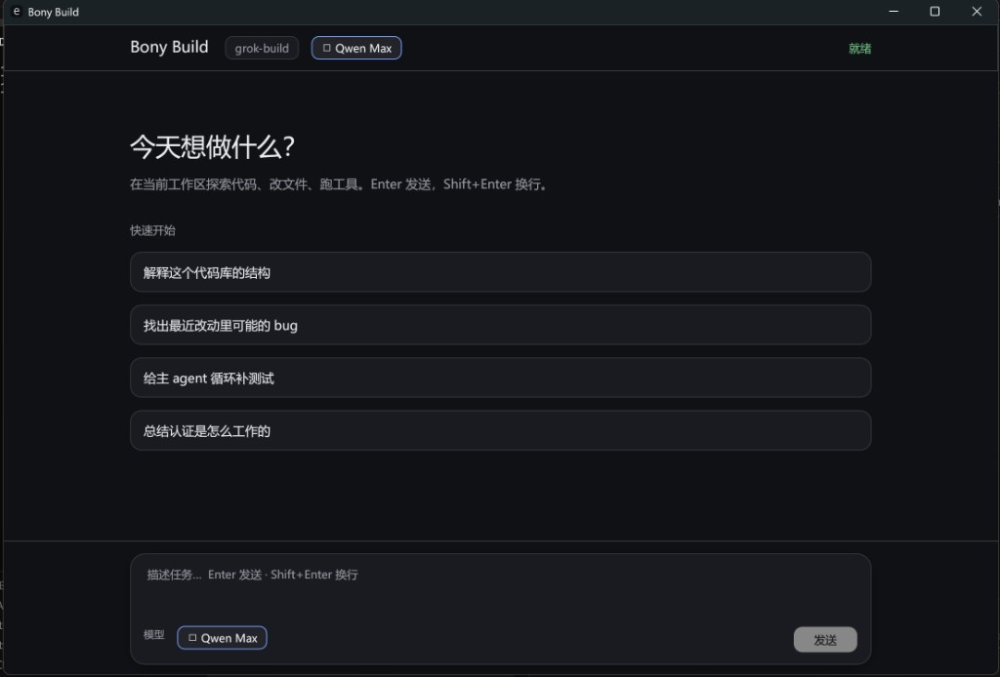

<div align="center">

# Bony Build

**桌面端 AI 编程助手** — 在当前工作区探索代码、改文件、跑工具。

[快速开始](#快速开始) ·
[功能](#功能) ·
[Web 监控](#web-监控) ·
[模型与供应商](#模型与供应商) ·
[架构](#架构) ·
[开发](#开发)



</div>

---

## 这是什么

**Bony Build** 是一个原生桌面客户端（Rust / egui），通过 [ACP](https://agentclientprotocol.com/) 驱动本地 `grok agent stdio` 运行时，在仓库工作区里完成对话式编程：

- 解释代码库结构、排查最近改动中的问题
- 补测试、总结认证 / 架构等实现细节
- 自动调用终端、文件编辑、搜索等工具（默认可自动批准）

底层复用 SpaceXAI Grok agent 运行时；产品品牌与桌面壳为 **Bony Build**。仓库：[`phuhao00/bony-build`](https://github.com/phuhao00/bony-build)。

---

## 功能

| 能力 | 说明 |
|------|------|
| 对话工作区 | 左对齐时间线、Markdown 渲染、用户气泡 / 助手卡片 |
| 快速开始 | 一键发起常见任务（解释结构、找 bug、补测试、总结认证等） |
| 模型切换 | 顶栏 / 输入区点击模型名，切换当前会话并写入默认配置 |
| 多供应商 | Kimi / Qwen / 智谱 / OpenAI 兼容端 / Anthropic Messages 等 |
| 工具与权限 | 内联工具卡片；可选人工批准（`--ask-permissions`） |
| 中文界面 | 系统中文字体（如微软雅黑），避免乱码 |
| 快捷键 | **Enter** 发送，**Shift+Enter** 换行 |
| Web 监控 | 架构分层总览 + 每次提交的影响 / 改进 / 风险时间线 |

---

## Web 监控

本地仪表盘，用于查看 **整体架构** 与 **每一次改动带来的影响**：

```powershell
powershell -ExecutionPolicy Bypass -File .\scripts\run-monitor.ps1
# 浏览器打开 http://127.0.0.1:8787
```

能力：

- **功能影响矩阵**：对话、模型切换、登录认证、多供应商、工具执行、权限、会话 ACP、工作区、TUI、监控、文档等
- **多维度评估**：用户体验 / 功能能力 / 安全 / 稳定性 / 兼容性 / 性能 / 开发体验 / 文档
- 每次提交的**用户影响说明** + **建议验证清单**
- 架构分层、流程图与截图
- 支持在 commit message 写 `Impact:` / `改进:` / `Risk:` / `风险:`

实现：`crates/codegen/bony-monitor`（Axum）。

---

## 快速开始

### 依赖

1. **Rust**（见 [`rust-toolchain.toml`](rust-toolchain.toml)）
2. **`grok` CLI**（agent 子进程）  
   ```powershell
   npm i -g @xai-official/grok
   grok --version
   ```
3. **凭证**（任选其一）  
   - 在 `%USERPROFILE%\.grok\config.toml` 配置 BYOK 模型 + 对应环境变量（推荐）  
   - 或 `grok login` / `XAI_API_KEY`

### 启动桌面端

```powershell
# 推荐
powershell -ExecutionPolicy Bypass -File .\scripts\run-desktop.ps1

# 或
$env:CARGO_TARGET_DIR = "$PWD\target"
cargo run -p bony-build
```

常用参数：

```text
--cwd <path>        会话工作目录（默认当前目录）
--grok-bin <path>   grok 可执行文件路径
--ask-permissions   工具需手动批准（默认自动批准）
```

Windows 若遇到 **os error 4551**（Smart App Control），请在可信终端中构建，或关闭 SAC 后重试。

### 也可使用终端 TUI

本仓库仍包含完整 `grok` TUI / agent 源码：

```powershell
powershell -ExecutionPolicy Bypass -File .\scripts\run-dev.ps1
# 或
cargo run -p xai-grok-pager-bin
```

官方预编译安装：

```powershell
irm https://x.ai/cli/install.ps1 | iex
```

---

## 模型与供应商

模型目录与默认值由 `%USERPROFILE%\.grok\config.toml` 决定。桌面端启动后可点 **▾ 模型名** 切换；选择结果会同步写入 `[models] default`。

也可点弹窗中的 **编辑 config.toml** 手动配置。示例（通义 Qwen / DashScope）：

```toml
[models]
default = "qwen-max"
stream_tool_calls = false

[model.qwen-max]
model = "qwen-max"
base_url = "https://dashscope.aliyuncs.com/compatible-mode/v1"
name = "Qwen Max"
env_key = "DASHSCOPE_API_KEY"
api_backend = "chat_completions"
context_window = 32768
```

已验证可配：

| 供应商 | 典型 `base_url` | 环境变量 |
|--------|-----------------|----------|
| 通义 Qwen | `https://dashscope.aliyuncs.com/compatible-mode/v1` | `DASHSCOPE_API_KEY` |
| Kimi / Moonshot | `https://api.moonshot.cn/v1` | `MOONSHOT_API_KEY` |
| 智谱 GLM | `https://open.bigmodel.cn/api/paas/v4` | `ZHIPUAI_API_KEY` |
| OpenAI 兼容 | 任意 `/v1` 端点 | 自定义 `env_key` |

更多协议（Anthropic `messages`、Responses API、Ollama 等）见：  
[`crates/codegen/xai-grok-pager/docs/user-guide/11-custom-models.md`](crates/codegen/xai-grok-pager/docs/user-guide/11-custom-models.md)

配置或环境变量变更后请**重启桌面端**。可用 `grok models` 核对当前目录。

---

## 架构

```text
Bony Build (egui 桌面壳)
        │  ACP JSON-RPC over stdio
        ▼
grok agent stdio  →  MvpAgent / SessionActor
        │
        ├─ 采样（多 backend）
        ├─ 工具（终端 / 文件 / 搜索 …）
        └─ Workspace / MCP / 子 agent
```

- 桌面 crate：[`crates/codegen/bony-build`](crates/codegen/bony-build)
- 详细分层与 turn 流程：[`ARCHITECTURE.md`](ARCHITECTURE.md)
- 架构图：[`docs/architecture-layers.png`](docs/architecture-layers.png)、[`docs/architecture-turn-flow.png`](docs/architecture-turn-flow.png)

桌面端**不**内嵌完整 agent 运行时，而是驱动已安装的 `grok` 子进程。

---

## 仓库布局（摘要）

| 路径 | 说明 |
|------|------|
| `crates/codegen/bony-build` | Bony Build 桌面客户端 |
| `crates/codegen/bony-monitor` | 架构与改动影响 Web 监控 |
| `crates/codegen/xai-grok-shell` | Agent 运行时、stdio / headless |
| `crates/codegen/xai-grok-pager*` | 官方 TUI（`grok`） |
| `crates/codegen/xai-grok-agent` / `*-tools` / `*-workspace` | Agent、工具、工作区 |
| `scripts/run-desktop.ps1` | 桌面端一键构建运行 |
| `scripts/run-dev.ps1` | TUI 开发启动 |
| `docs/` | 截图与架构图 |

完整上游说明仍见各 crate 文档与 [user guide](crates/codegen/xai-grok-pager/docs/user-guide/)。

---

## 开发

```powershell
$env:CARGO_TARGET_DIR = "$PWD\target"
$env:PROTOC = "$PWD\.tools\protoc\bin\protoc.exe"   # 若已放置 protoc
cargo build -p bony-build
cargo run -p bony-build -- --cwd $PWD
```

建议忽略本地产物：`target/`、`.tools/`、各类 `*.log`。

---

## 文档与许可

- 用户指南：[`crates/codegen/xai-grok-pager/docs/user-guide/`](crates/codegen/xai-grok-pager/docs/user-guide/)
- 认证：[`02-authentication.md`](crates/codegen/xai-grok-pager/docs/user-guide/02-authentication.md)
- 自定义模型：[`11-custom-models.md`](crates/codegen/xai-grok-pager/docs/user-guide/11-custom-models.md)

本仓库含从 SpaceXAI monorepo 同步的 agent / TUI 源码；桌面产品层为 Bony Build。许可证见根目录 [`LICENSE`](LICENSE)（若存在）及各 crate 声明。

---

## 致谢

Agent 运行时与 `grok` CLI 能力来源于 [SpaceXAI / Grok Build](https://x.ai/cli) 生态。Bony Build 在其上提供多供应商桌面体验。
